# Zero_to_Billions_CodeNection
This is a repository for Zero to Billions

**Team:** Lwee Wee Ming, Liew Jing Lin, So Ern Ning, Tee Wei Xi  
**Problem Statement:** Stress & Workload Manager  
**Video Presentation:** [Unlisted YouTube Link]  
**Presentation Slides:** [Public Link]  

---

## 1. Project Overview

### The Problem

University students often manage many things at the same time: assignments, exams, club activities, part-time work, social commitments, errands and personal needs. When deadlines overlap and students do not get enough rest, their workload can become difficult to control. This may lead to high stress, fatigue, poor sleep, missed deadlines, lower academic performance and less time for personal life.

The main stakeholder is the **university student**. Other people such as classmates, project teammates and lecturers can also affect the student's daily load through deadlines, group work, schedule changes and messages.

Existing apps usually solve only one part of the problem. For example, task-management apps such as **Todoist** mainly help users organise tasks and deadlines, wellness apps such as **Headspace** focus mainly on relaxation and mental wellbeing, while built-in phone Focus or Do Not Disturb tools mainly reduce interruptions. These tools are useful, but they do not normally connect the student's workload, current condition, recovery needs and attention protection in one workflow.

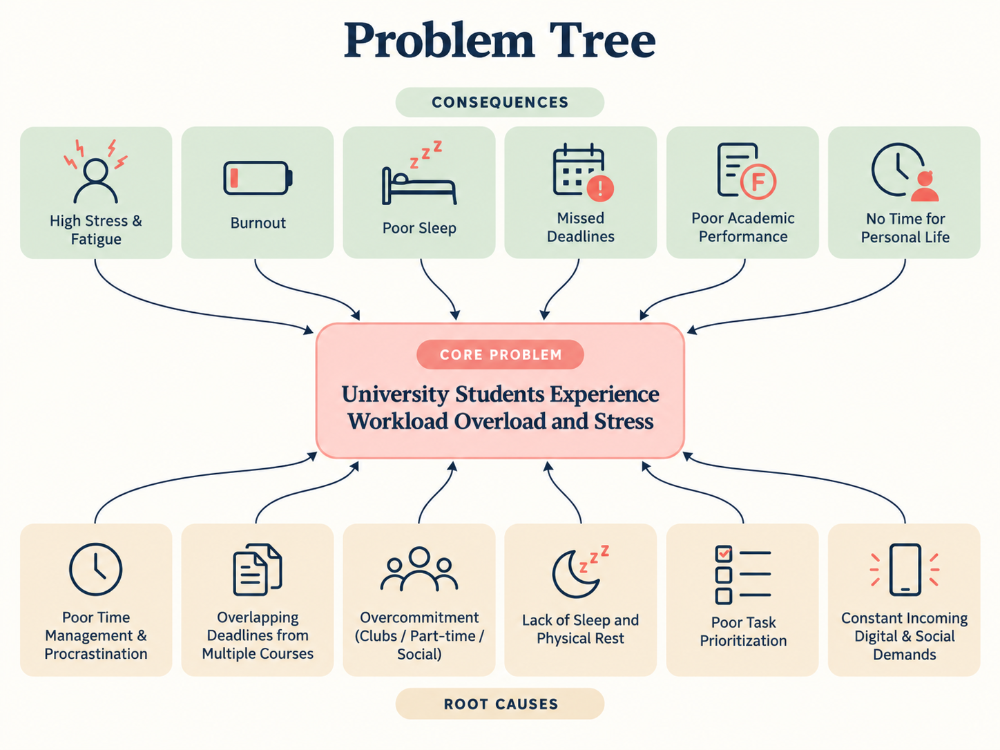

### Our Solution

**LoadLight** is a mobile workload and wellbeing assistant designed for university students. It combines task planning, AI-supported schedule rebalancing, recovery support and attention protection. Instead of only asking students to finish more tasks, LoadLight tries to understand how much load the student is carrying and how they are feeling at that moment. The system then helps the student decide whether to continue, recover, rebalance or protect their focus.

### Final Feature Set

- **Account & Baseline Profile** — New users complete a short baseline profile so the system understands their normal routine, study style and lifestyle.
- **Daily Check-In** — Students update sleep quality, social battery and mental load before starting the day.
- **Live State Override** — Students can manually update their current state later from the Home Dashboard.
- **Task & Deadline Input** — Students can add tasks, dates, priorities, categories and estimated time.
- **Internal Workload Analysis** — LoadLight combines the user's baseline profile, Daily Check-In and task information to analyse workload in the background. The detailed workload indicators are not shown to users, helping keep the interface simple and avoid creating extra stress.
- **Overload / Stress Detection** — LoadLight quietly analyses the user's current state and workload. When possible overload is detected, the system can trigger a gentle stress alert and suggest a Quick Reset.
- **Quick Reset** — Students can enter from the Home Dashboard or from an AI-generated stress alert and use a short recovery activity.
- **Lumi Session** — Students can start a task with Lumi, use a countdown session and receive a tension-release prompt when working for too long.
- **AI Rebalance** — AI suggests schedule changes, explains why they help and shows a Before vs After view.
- **User-Approved Changes** — Students choose whether to accept the new schedule or keep the original one.
- **LoadShield** — Students choose a protection mode to reduce interruptions while they need focus or recovery time.
- **Pressure Digest** — Notifications are grouped into items that need attention and items that can wait.
- **Profile & Settings** — Students can manage profile information, reminders, baseline settings, app preferences and appearance.

---

## 2. Ideation & Process

### 2.1 Ideas We Considered

The idea changed several times during the design process. The table below places the ideas used in the final prototype first, followed by ideas that were changed, postponed or dropped.

| Idea | Why it was kept / dropped |
|---|---|
| **Daily Check-In — Kept** | Gives the system a simple daily picture of the student's current condition. |
| **Baseline Profile — Kept** | Helps the system understand the user's normal routine before making later recommendations. |
| **Manual State Override — Kept** | A student's condition can change during the day, so the live state should not stay fixed after the morning check-in. |
｜ **Task & Deadline Input — Kept** | Core workload data is needed before the system can analyse risk or suggest changes.
| **Internal Workload Analysis — Kept, but moved to background** | The system still considers different types of load together with baseline, Daily Check-In and task information. However, the detailed load map is no longer shown to users because displaying too many workload indicators may create extra stress. |
| **Overload Risk Detection — Kept** | LoadLight analyses the user's current condition and workload quietly in the background. If possible overload is detected, the system can trigger a gentle stress alert and suggest Quick Reset. The same analysis also supports AI Rebalance when the user chooses to open it. |
| **AI Rebalance — Kept** | Helps students reduce overloaded periods instead of only showing that they are busy. |
| **Before vs After Schedule — Kept** | Makes the AI recommendation easy to understand before the student decides. |
| **User-Approved Schedule Change — Kept** | Keeps the student in control. AI suggests changes but does not force them. |
| **Quick Reset — Kept and expanded** | Became a short recovery flow that can be started manually or triggered by AI when stress is detected. |
| **Lumi Session — Kept** | Connects planning with real task execution and gives support while the student is actually working. |
| **LoadShield — Kept and expanded** | Protects attention when the student needs quiet, while still separating important information from non-urgent noise. |
| **Pressure Digest — Kept** | Lets students review what needs attention after or during a protected period instead of receiving every interruption immediately. |
| **Recovery Feedback — Kept in a simple form** | After Quick Reset, the student can report whether they feel worse, the same or better. |
| **Intervention Reason — Kept in a simple form** | AI Rebalance explains why a change is suggested instead of giving a result without explanation. |
| **Micro Recovery — Changed** | The original idea of simple recovery actions evolved into Quick Reset and Lumi Session interactions. |
| **Automatic Schedule Modification — Changed** | The first idea allowed AI to change the schedule automatically. It was changed because users should keep control over important schedule decisions. |
| **Mini Games — Dropped** | Required extra development and did not directly support the main workload problem. |
| **Reward / Gamification System — Dropped** | Could shift attention from workload management to collecting rewards and would add unnecessary scope. |
| **What-If Sandbox — Postponed** | Useful idea, but it adds more scheduling logic and is not required to demonstrate the main final flow. |
| **Tomorrow Risk Preview — Postponed** | Helpful for future planning, but lower priority than today's workload and recovery flow. |
| **Load Debt Warning — Postponed** | Requires longer-term data and additional calculation logic. |
| **Smart Task Carry-over — Postponed** | Can be added later after the core task and rebalance system is stable. |
| **Daily Wrap-up / Day Closure — Postponed** | Useful supporting feature, but not essential for the hackathon build. |

### 2.2 Ideation Boards

#### A. Initial Exploration of the Two Official Problem Statements

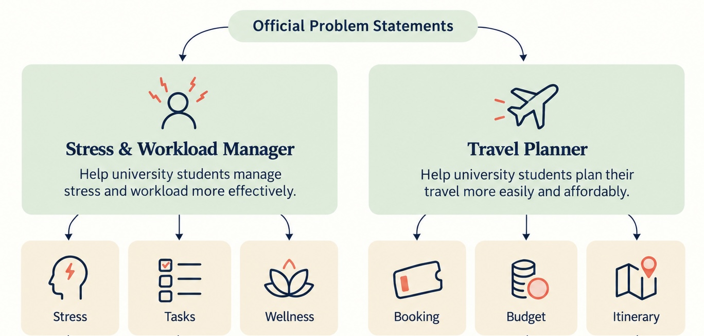

*We first explored both official directions instead of selecting one immediately. Stress & Workload focused on stress, tasks and wellness, while Travel Planner focused on booking, budget and itinerary planning.*

#### B. Why Travel Planner Was Not Selected

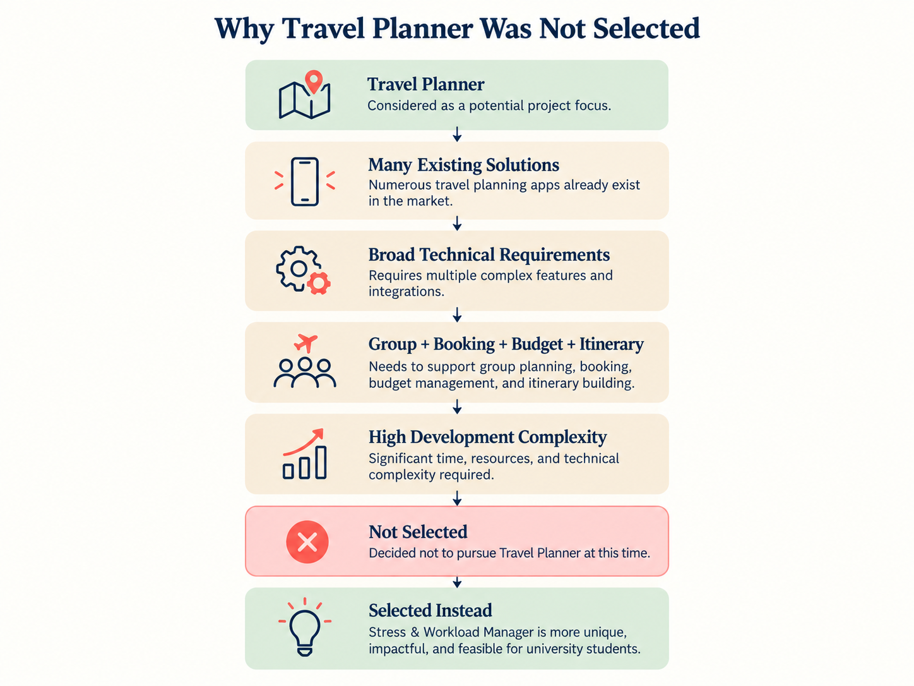

*Travel Planner was not selected because the market already contains many mature travel solutions and a complete travel platform would require a wide range of technical integrations.*

For example
•	Pi Travel: AI itinerary planning, travel-guide analysis, group collaboration and adjustment of later plans when  changes occur.
•	Gooh Travel: Itinerary editing, group collaboration, AI planning, maps, travel bills and packing-list functions.
•	Shiliufan: Attraction/food collection, maps and itinerary planning.
•	Trip.com: A one-stop travel platform covering hotels, flights, trains, tickets, guides and an AI travel assistant.

#### C. Problem Tree

*This board helped us identify the root causes of student overload and the consequences we wanted our solution to reduce.*

#### D. Opportunity Gap

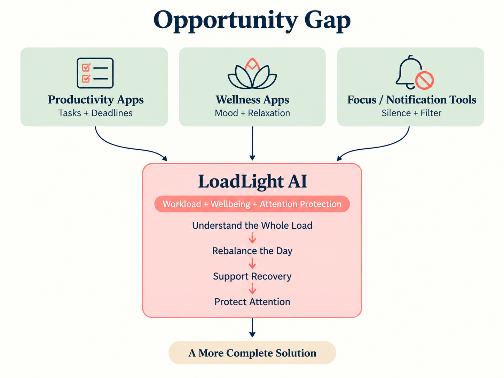

*We identified a gap between productivity apps, wellness apps and focus tools. LoadLight was developed to connect workload management, wellbeing and attention protection instead of treating them as separate problems.*

#### E. Final User Flow

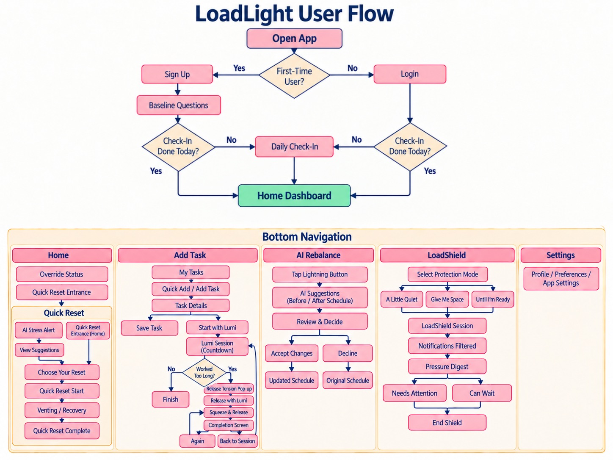

*The final user flow connects onboarding and daily check-in with five main areas: Home, Add Task, AI Rebalance, LoadShield and Settings. Quick Reset is part of the Home flow, while Lumi Session is connected to actual task execution.*

### 2.3 Mentor Consultation

| Date | Mentor | Feedback Received | What Was Changed |
|---|---|---|---|
| **31 Aug 2026** | **Khor Jia Quan** | The original feature list was too large. Focus on an MVP and prioritise the core workflow. The team had more web experience than mobile experience, so the prototype should stay realistic. | We reduced the early 18-feature concept, focused on the core workload flow and changed AI schedule editing into user-approved recommendations. |
| **6 Sep 2026** | **Tay Ming En** | Use less red because strong red can make the UI feel stressful. The app also needed a clearer unique selling point. Quick Reset could be developed further and simple animation could make the experience more interactive. | The interface moved toward a softer beige/coral style. Quick Reset was expanded and interactive recovery ideas such as Lumi were strengthened. |
| **8 Sep 2026** | **Teng Wei Herr** | “Get to Know More” was not needed. The team could continue extending the LoadShield direction. React Native, Expo and Supabase were suggested for development. | We removed the unnecessary section, developed LoadShield and Pressure Digest further and selected React Native + Expo + Supabase as the main development stack. |

---

## 3. Design & Prototype

**UI Prototype:** https://www.figma.com/design/OPFG024MPbkxJECuyOS0Od/Codenection-Hackathon--Please-edit-here-?node-id=0-1&t=4GiqYazq1AiIId8a-1

The final prototype uses a warm beige background with coral highlights and simple cards. We try to avoid a stressful dashboard style and keep important actions clear. The prototype also uses small characters such as **Lumi** to make recovery interactions feel lighter without turning the app into a game.

### 3.1 Onboarding & Baseline Profile

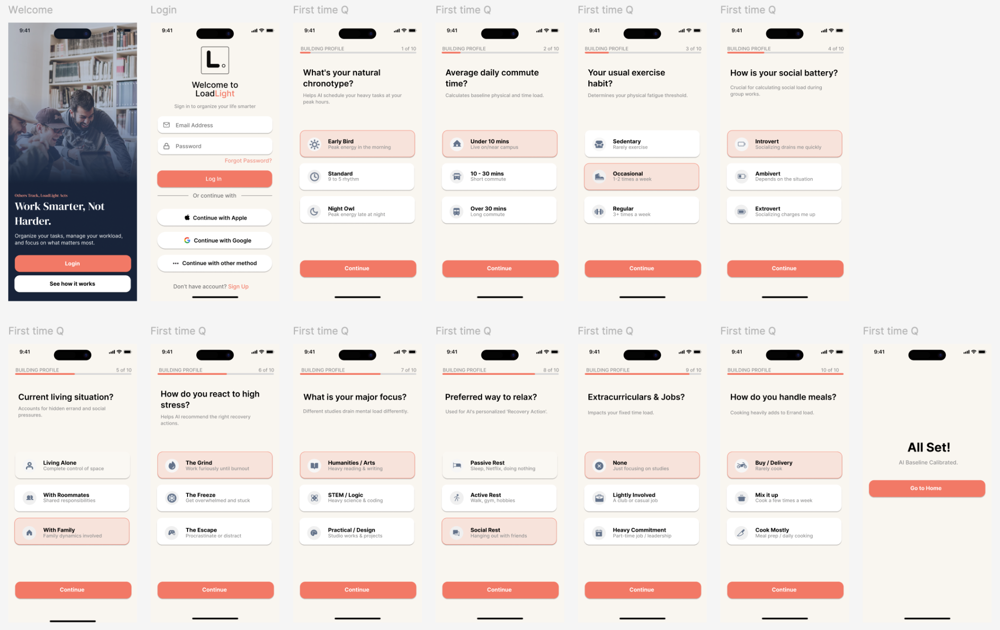

*New users sign up and answer 10 short baseline questions. The questions cover areas such as chronotype, commute, exercise, social battery, living situation, stress response, study type, relaxation preference, extracurricular commitments and meals.*

### 3.2 Daily Check-In & Home Dashboard

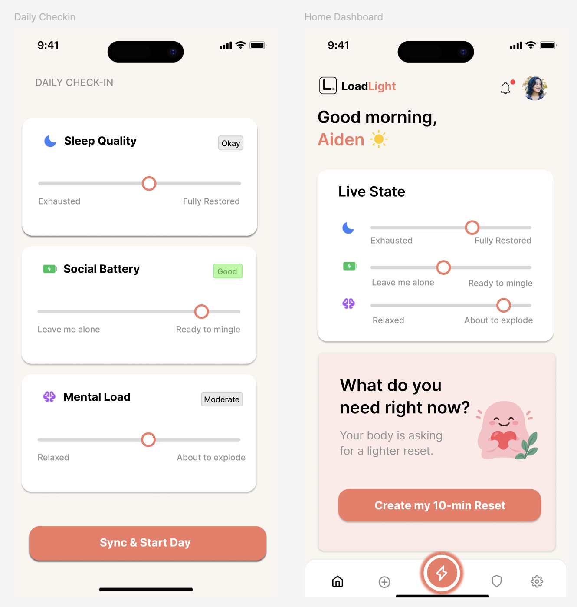

*On the first app opening of the day, the user completes the Daily Check-In before entering the Home Dashboard. The Home Dashboard shows the user's live state and lets the user create a 10-minute reset when needed.*

### 3.3 Quick Reset

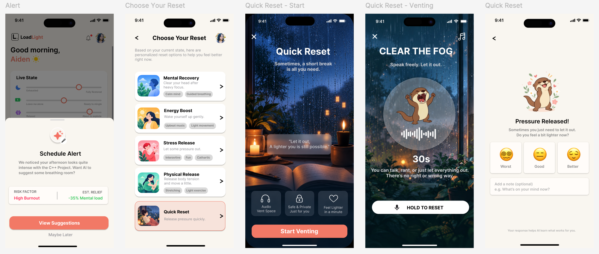

*Quick Reset has two entry paths. The user can start it manually from Home, or LoadLight can generate a stress alert and bring the user to recovery suggestions. The prototype demonstrates a short venting flow followed by feedback.*

### 3.4 Task & Deadline Input

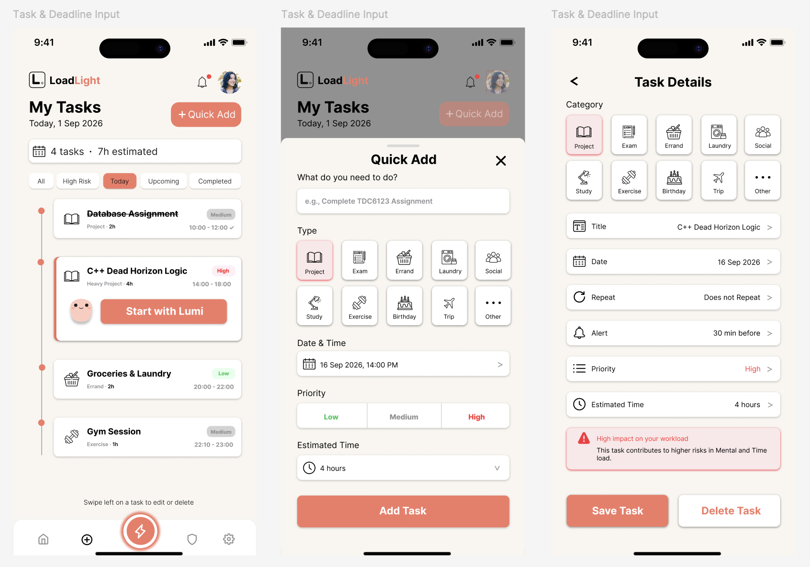

*Students can add or edit tasks with category, date, repeat settings, alert, priority and estimated duration. High-impact tasks can be highlighted so the user understands how a task affects the overall workload.*

### 3.5 Lumi Session

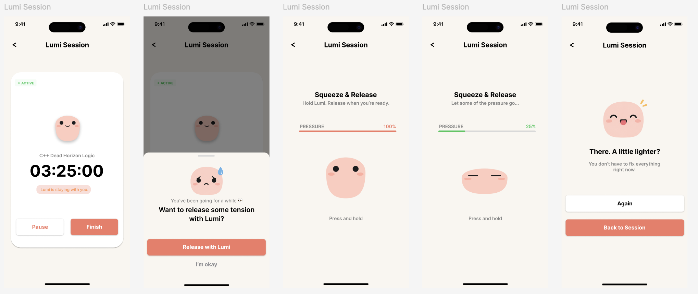

*The user can press “Start with Lumi” when they actually begin a task. If the session becomes too long, Lumi can suggest a short tension release. The user holds the screen to squeeze and release Lumi, then can repeat the interaction or return to the running task session.*

### 3.6 AI Rebalance

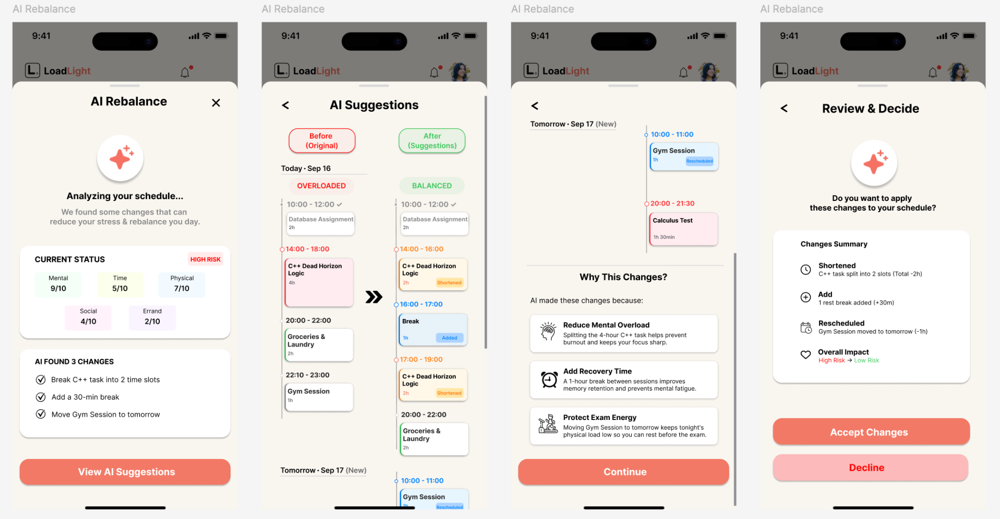

*AI Rebalance reviews the current load, proposes schedule changes and shows the original schedule beside the suggested schedule. It also explains the reason for each change. The student can accept the changes or decline and keep the original plan.*

### 3.7 LoadShield & Pressure Digest

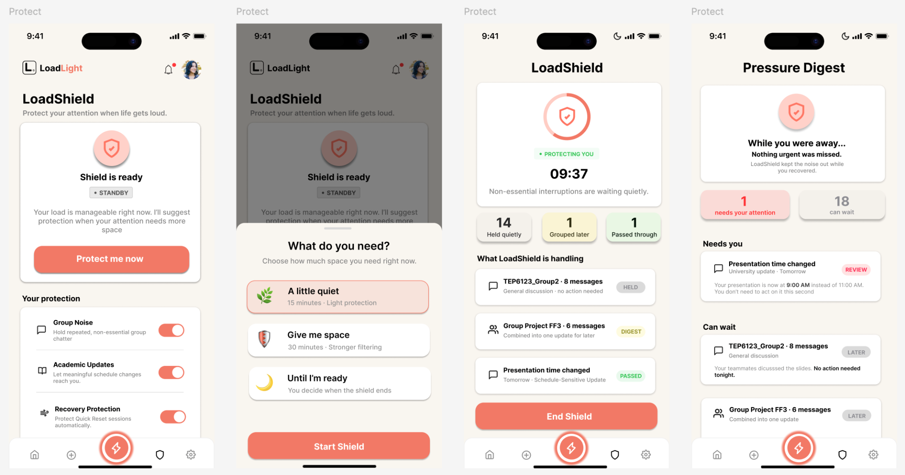

*LoadShield gives the user three levels of protection: A Little Quiet, Give Me Space and Until I'm Ready. During the session, interruptions are filtered and grouped. Pressure Digest later separates items that need attention from items that can wait.*

### 3.8 Profile & Settings

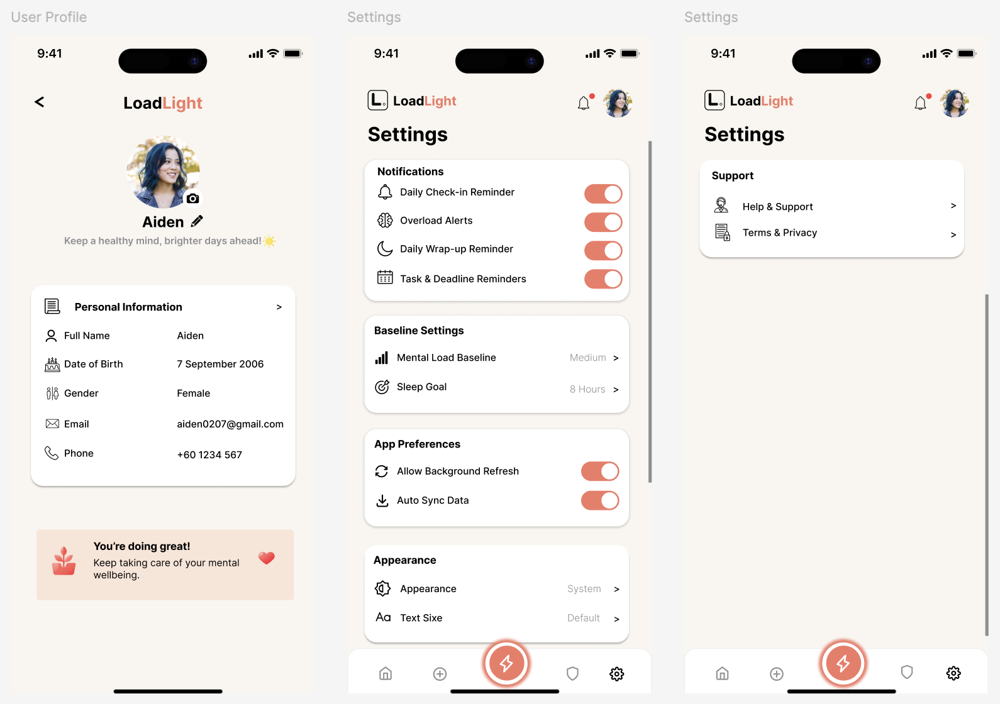

*The Profile and Settings screens manage user information, reminders, baseline settings, app preferences, appearance, support and privacy-related options.*

---

## 4. What Makes It Different

LoadLight is not designed as only a to-do list, meditation app or notification blocker. Its main difference is that these parts are connected into one student-focused flow.

### Key Differences

1. **Understands the whole load**  
   LoadLight combines tasks with the user's current state instead of judging workload only by the number of tasks. This analysis happens quietly in the background instead of showing the user a complex workload dashboard.

2. **Supports the student while work is happening**  
   Lumi Session starts when the student actually begins a task, so LoadLight can support the student during the work session instead of only during planning.

3. **Recovery can be proactive or user-initiated**  
   Quick Reset can be triggered by AI when overload is detected or opened manually when the student feels they need a break.

4. **AI suggestions remain under user control**  
   LoadLight shows a Before vs After schedule and explains the reason for the changes. The user decides whether the recommendation should be applied.

5. **LoadShield does more than silence notifications**  
   The goal is not only to block interruptions. LoadShield also groups incoming information and gives the student a Pressure Digest so important items can still be identified.

6. **Workload, wellbeing and attention protection are connected**  
   Daily state, task load, recovery and interruption management use the same user context instead of operating as separate tools.

### Simple Comparison
| Capability | Typical Task App | Wellness App | Focus / DND Tool | **LoadLight** |
|---|:---:|:---:|:---:|:---:|
| Tasks & deadlines | ✓ |  |  | ✓ |
| Daily wellbeing state |  | ✓ |  | ✓ |
| Workload risk analysis | Limited |  |  | ✓ |
| AI schedule rebalance |  |  |  | ✓ |
| Recovery interaction |  | ✓ |  | ✓ |
| Task execution support | Limited |  |  | ✓ Lumi Session |
| Notification protection |  |  | ✓ | ✓ LoadShield |
| Urgent vs non-urgent digest |  |  | Limited | ✓ |

---

## 5. Technical Architecture & Feasibility

### 5.1 Tech Stack

| Area | Technology | Why We Chose It | Expected Constraints |
|---|---|---|---|
| **Frontend** | React Native | One codebase can target both Android and iOS. It is suitable for a mobile-first version of LoadLight. | The team is new to React Native, so there will be a learning curve. Some device-level functions may need native configuration. |
| **Development Framework** | Expo | Speeds up setup, testing and mobile prototyping. | Some advanced notification or background features may require an Expo development build or extra native permissions instead of only Expo Go. |
| **Backend / Database / Authentication** | Supabase | Provides authentication, PostgreSQL database, storage and backend services in one platform. The free tier is suitable for a hackathon prototype. | Free-tier limits apply, and the team must design database access rules carefully. |
| **AI Service** | DeepSeek API | Lower cost makes it practical for prototype AI suggestions and explanations. | Requires internet access, API latency must be handled, and the API key must not be stored directly inside the mobile app. |
| **API Proxy / Server Logic** | Supabase Edge Functions | Keeps API keys away from the client and sends only required task and state data to the AI service. | Adds backend setup and request limits. |
| **Mobile Build / Demo** | Expo Development Build / EAS | Suitable for testing and sharing the hackathon mobile build. | Device permissions and platform differences must be tested on real devices. |

### 5.2 System Architecture Diagram

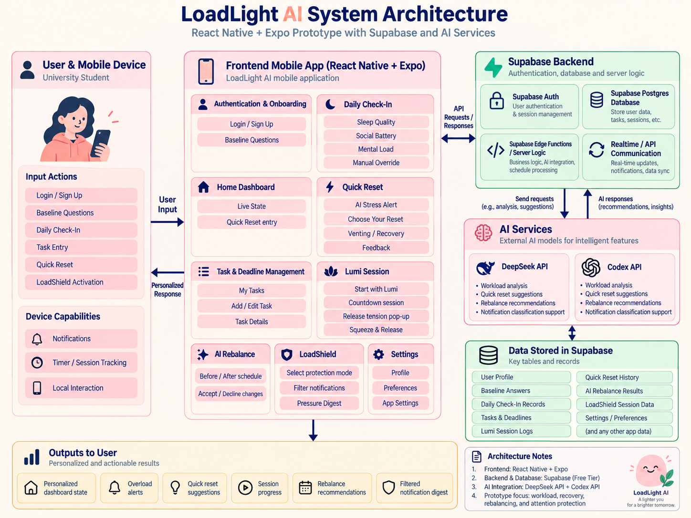

### 5.3 How the Main Data Flow Works

1. The user signs in and the baseline profile is stored in Supabase.
2. The Daily Check-In updates the student's current state.
3. Tasks and deadlines are stored together with priority, category and estimated time.
4. LoadLight combines baseline data, Daily Check-In and task data to analyse workload risk internally. The detailed workload indicators are not shown to the user.
5. If possible overload is detected, LoadLight can show a gentle stress alert and suggest Quick Reset.
6. AI Rebalance sends only the required structured context through the backend proxy to the AI service, then returns proposed changes and explanations.
7. The student accepts or rejects the changes.
8. Lumi Session and Quick Reset provide recovery support during the day.
9. LoadShield uses available device permissions and notification data to reduce interruptions and prepare a Pressure Digest using AI service.

### 5.4 Build Plan & Scope

The earlier pre-prototype focused on a smaller MVP of Daily Check-In, Task Input, Internal Workload Analysis， Risk Detection, Smart Rebalance and Before/After comparison. After later mentor feedback and UI iteration, the final prototype keeps that core but adds **Quick Reset, Lumi Session and LoadShield** because these features make the idea more complete and more different from a normal productivity app.

For the building phase, we plan to build the following demo-ready scope:

1. **Authentication + Baseline Profile**  
   Sign up/login, 10 baseline questions and user profile storage.

2. **Daily State + Home Dashboard**  
   Daily Check-In, live state display and manual state override.

3. **Task Management + Lumi Session**  
   Add/edit tasks, estimated duration, priority and Start with Lumi countdown. A long session can trigger the tension-release interaction.

4. **Quick Reset**  
   Support both entry paths: AI-generated stress alert and manual entry from Home. The build will demonstrate at least one complete recovery flow and feedback step.

5. **AI Rebalance**  
   Analyse workload, generate suggested schedule changes, show Before vs After, explain the reason and support Accept / Decline.

6. **LoadShield + Pressure Digest**  
   Build the three protection modes and demonstrate classification of notification items into urgent/needs-attention and can-wait groups.

7. **Profile & Settings**  
   Basic profile data, reminders, preferences and app settings.

### 5.5 Feasibility Notes

Some final-product ideas require deeper operating-system access than a normal prototype can guarantee. In particular, fully reading and filtering notifications from every third-party app depends on Android/iOS permissions and platform restrictions. For the hackathon build, LoadShield can demonstrate the intended experience using notification data that the app is allowed to access or a controlled set of demo notifications, while keeping the final product direction unchanged.

The same principle applies to AI. The system will keep the user's main data in Supabase and send only the information required for a specific AI request through a backend function. This reduces the risk of exposing API keys and keeps the architecture easier to expand later.

### 5.6 Out of Scope for the Current Build

To keep the build realistic, the following ideas are not required for the first working version:

- What-If Sandbox
- Tomorrow Risk Preview
- Load Debt Warning
- Full long-term recovery analytics
- Mini games
- Reward / cosmetic gamification
- Advanced automatic task carry-over
- Connection to Apple Watch 
- Sync to Campus Website and Student Emails

These ideas can be revisited after the main LoadLight workflow is working reliably.

---

## Final Direction

LoadLight AI began as a workload manager, but the final prototype has developed into a broader **student load-management system**. The goal is not simply to make students more productive. LoadLight helps students understand their current load, recover when needed, rebalance overloaded schedules and protect their attention when life becomes too noisy.
